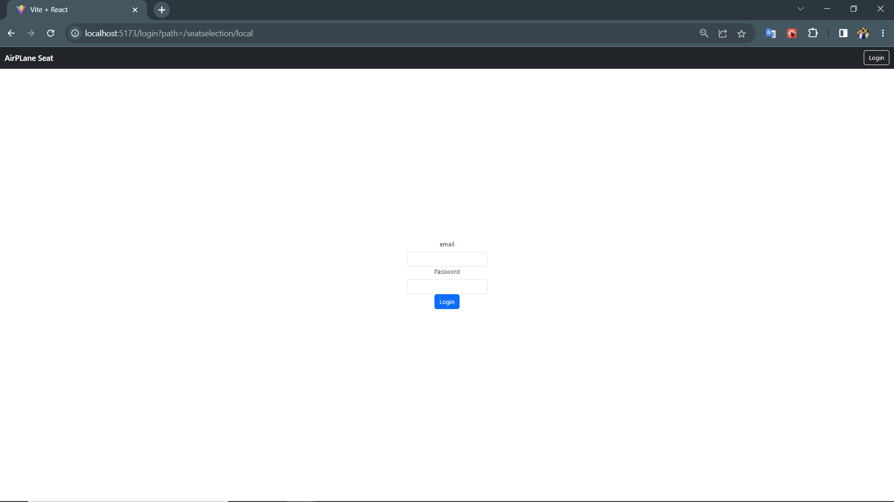
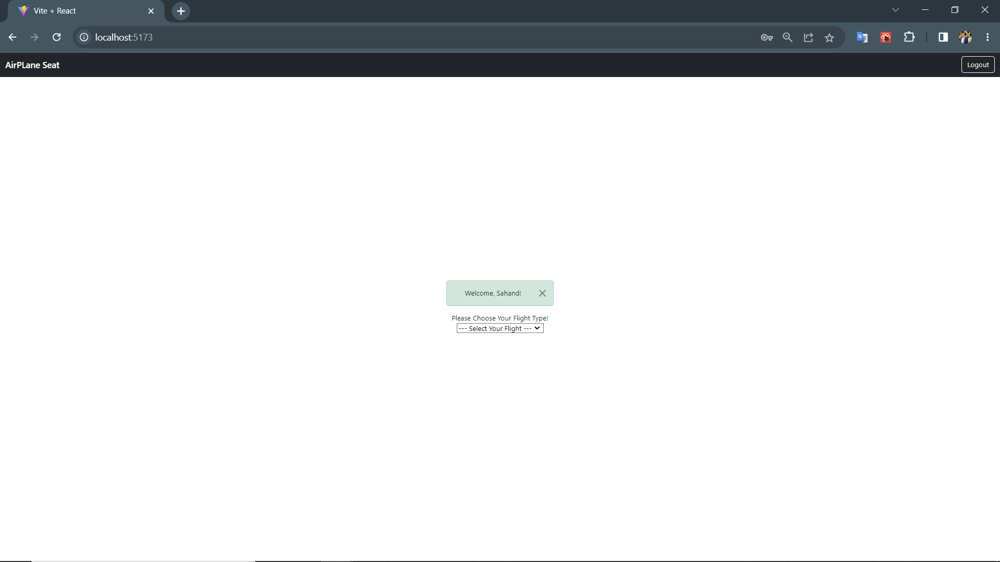
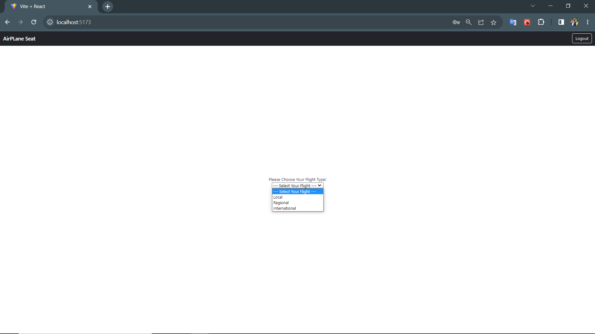
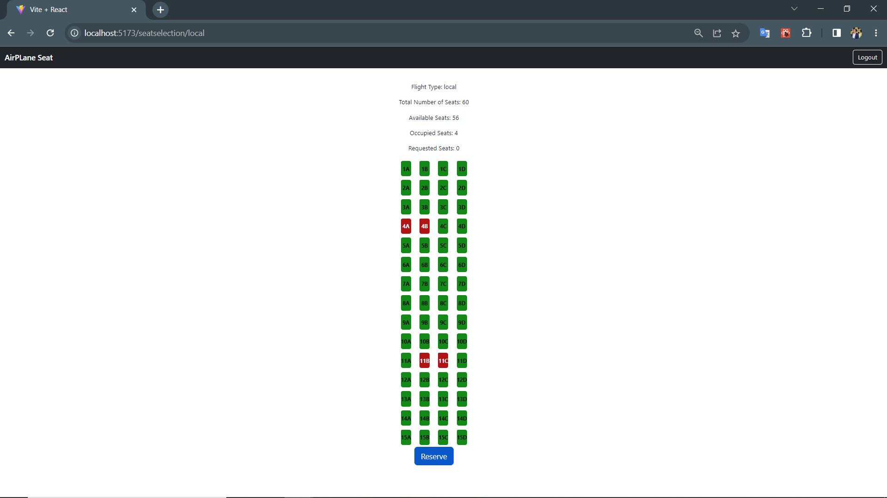
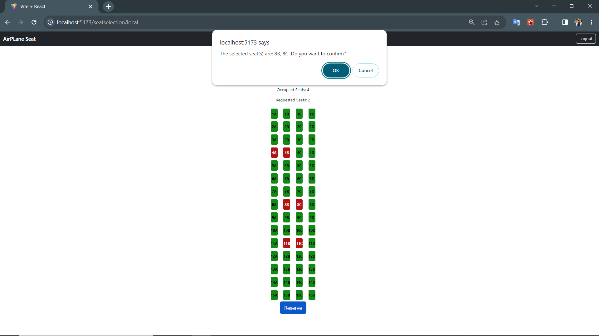
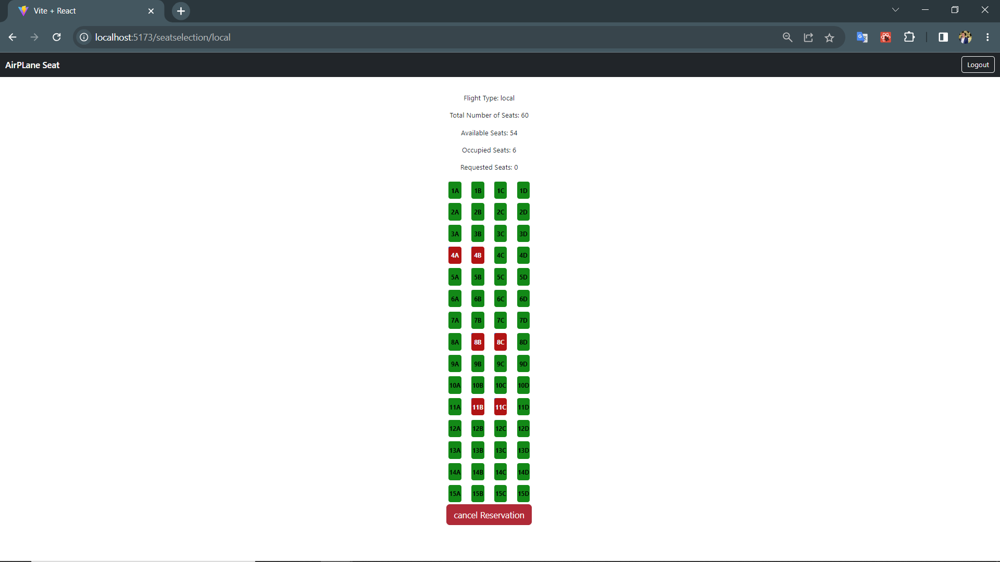
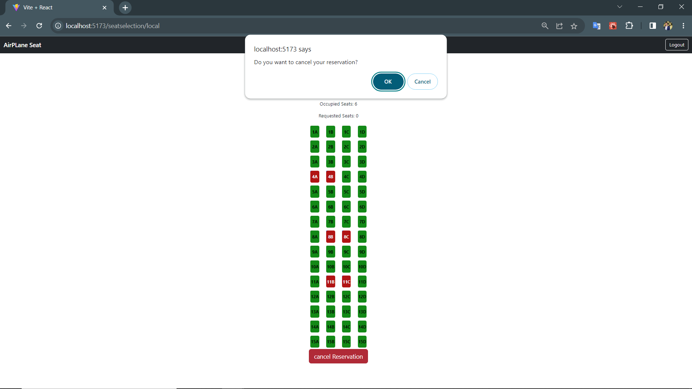

## Student: s309457 Seyed Mohammadghavami Sahand 

## React Client Application Routes

- Route `/`: Main page of the application, where the user selects the plane type.
- Route `/login`: The login page for users.
- Route `/seatselection/:type`: The visualization page of the plane according to the type that user selected in the main page, type: plane type. Has been passed from main page.

## API Server
### <ins>Plane APIs</ins>
#### **GET `/api/seatAvailability/:flightType`**
  - **Returning an array containing details about planes(flights).**
  - **Request header** : req.params.flightType to retrieve flight type 
  request parameters and request body content
  - **Request body**: empty.
  - **Response**:  `200 OK` (success); body: An array of abjects, each describe flightId, flightType, rows, seatsPerRow, seatAvailability, occupiedSeatsIds, occupiedSeats, availableSeats, totalSeats of that flight type.
  ```
    {
      "flightId": 2,
      "flightType": "regional",
      "rows": 20,
      "seatsPerRow": 5,
      "seatAvailability": {
          "rows": 20,
          "seatsPerRow": 5
      },
      "occupiedSeats": 0,
      "availableSeats": 100,
      "totalSeats": 100
  }
  ```

  #### **POST `/api/reservations`**
  - **Making a reservation that corresponds to the user ID and flight ID.**
  - **Request header** : empty.
  - **Request body**: a JSON object containing the user ID, flight ID and selected seats to be added in reservations table.
  ```
    { 
      user_id: 1, 
      flight_id: 1, 
      selectedSeats: ["3C", "3D"] 
    }

  ```
  - **Response**:  `200 OK` (success); body: An array of abjects, each describe user_id, flightId, selectedSeats, rows, seatsPerRow, seatAvailability, occupiedSeatsIds, occupiedSeats, availableSeats, totalSeats.
  ```
    {
      "user_id": 1,
      "flight_id": 1,
      "selectedSeats": [
          "3C",
          "3D"
      ],
      "rows": 15,
      "seatsPerRow": 4,
      "seatAvailability": {
          "rows": 15,
          "seatsPerRow": 4
      },
      "occupiedSeatsIds": [
          "3C",
          "3D",
          "11B",
          "11C"
      ],
      "occupiedSeats": 4,
      "availableSeats": 56,
      "totalSeats": 60
    }
  ```
#### **GET `/api/reservationsByUserId`**
  - **Returning an array containing details about a specific user.**
  - **Request header** : empty.
  - **Request body**: a JSON object containing user_id, flight_id.
  - **Response**:  `200 OK` (success); body: An array contains the userOccupiedSeatsIds.
  ```
    { userOccupiedSeatsIds: ["3C", "3D"] }
  ```

#### **DELETE `/api/cancelReservations`**
- **Delete a flight reservation.**
- **Request header** : empty.
- **Request body**: a JSON object containing user_id, flight_id.
- **Response**:  `200 OK` (success); body: An array of abjects, each describe flightId, flightType, rows, seatsPerRow, seatAvailability, occupiedSeatsIds, occupiedSeats, availableSeats, totalSeats of that flight type.
```
  {
    "flight_id": 1,
    "flightType": "local",
    "rows": 15,
    "seatsPerRow": 4,
    "seatAvailability": {
        "rows": 15,
        "seatsPerRow": 4
    },
    "occupiedSeatsIds": [
        "11B",
        "11C"
    ],
    "occupiedSeats": 2,
    "availableSeats": 58,
    "totalSeats": 60
}
```

### <ins>User APIs</ins>
#### **POST `/api/sessions`**

**Creating new credentials in sessions**
- **Request body**: a JSON object containing of the user credentials to be authenticated.

    ```
        {
            "username": "student1@studenti.polito.it",
            "password": "123456789"
        }
    ```


- **Response**:  `200` (created). body:  An array of abjects, each describe user ID, username, name, and array of reservations made by the user.

```
{
    "id": 1,
    "username": "sahand.fc@gmail.com",
    "name": "Sahand",
    "reservations": [
        {
            "flight_id": 1,
            "user_id": 1,
            "seat": "9B",
            "type": "local"
        },
        {
            "flight_id": 1,
            "user_id": 1,
            "seat": "9C",
            "type": "local"
        }
    ]
}

```


#### **GET `/api/sessions/current`**

**Return an object of user's credentials.**
- **Request body**: empty.
- **Response**: `201` (OK).  body: An array of abjects, each describe user ID, username, name, and array of reservations made by the user.

```
{
    "id": 1,
    "username": "sahand.fc@gmail.com",
    "name": "Sahand",
    "reservations": [
        {
            "flight_id": 1,
            "user_id": 1,
            "seat": "9B",
            "type": "local"
        },
        {
            "flight_id": 1,
            "user_id": 1,
            "seat": "9C",
            "type": "local"
        }
    ]
}

```

#### **DELETE `/api/sessions/current`**

- **log out.**
- **Request header** : none
- **Request body**: none
- **Response header**:  `200` (OK).
- **Response body**: none.


## Database Tables

- Table `users` - contains id email password name
- Table `flights` - contains id type f p
- Table `reservations` - contains flight_id user_id seat

## Main React Components

- `LoginForm` (in `./componnents/AuthComponents.jsx`): Used in log in page and will handle login with Passport module
- `LogoutButton` (in `./componnents/AuthComponents.jsx`): Log out button on homepage for logging out to the homepage
- `Menu` (in `./componnents/Menu.jsx`): drop down menu for choosing a plane type.
- `SeatingLayout` (in `./componnents/FlightSeatsComponent.jsx`): this component is making a seat visualization in the seatVisualization page, and also initialize the texts that should be shown in this page.
- `ReserveButton` (in `./componnents/FlightSeatsComponent.jsx`): A button for reserving a flight. After confirming a reservation this button will change to the cancel reservation button, to allow the user to cancel his/her reservation.
- `NavHeader` (in `./componnents/NavbarComponent.jsx`): A navbar which contains login/logout button and the name of the site.
- `App` (in `./App.js`): Main component that handle all actions and other components, also it has local storage for states so states will not be lost on refresh.


## Screenshot

##### LogIn Route


##### Main Page



##### Reservation




##### Cancel Reservation


## Users Credentials

- sahand.fc@gmail.com, 123456789, name: Sahand
- test@gmail.com, 123456789, name: test
- soheil@gmail.com, 123456789, name: Soheil
- james@gmail.com, 123456789, name: James

